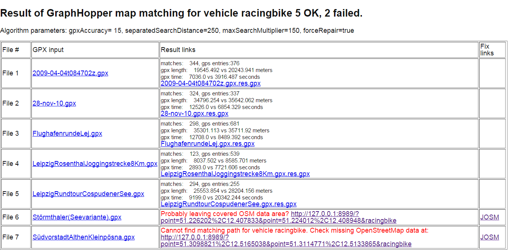

#OSM Daten Qualitätsverbesserung durch Analyse von GraphHopper "Map Matching" Ergebnissen

Bei der Evaluierung der GraphHopper "Map Matching" Implementierung mit 
vorhandenen GPX Daten aus der Vergangenheit hat sich herausgestellt, dass der im 
GraphHopper "Map Matching" verwendete 
[Algorithmus](https://karussell.wordpress.com/2014/07/28/digitalizing-gpx-points-or-how-to-track-vehicles-with-GraphHopper/ "Algorithmus") 
gut dafür genutzt werden kann, Fehler oder Unvollständigkeiten im vorhandenen 
OSM Datenmaterial zu erkennen. Wenn der Algorithmus keinen Weg findet ist es 
nämlich oft so, dass in den aufgezeichneten GPX Daten Wissen über mögliche 
und passierbare Verbindungen steckt, das bisher nicht in den OSM Daten 
abgebildet worden ist. Für die Analyse wird dabei ein HTML Report erzeugt,
über den die OSM Daten mit Hilfe von JOSM angesehen und bearbeitet werden können.

Im folgenden werden die dabei gemachten Erfahrungen und beschrieben, die es 
möglich machen ein Beispiel aus Leipzig nachzuvollziehen und es ermöglichen 
die Methode anhand eigener GPX Dateien zu testen.

Der Algorithmus versucht basierend auf der in GPX Daten enthaltenen Koordinaten 
anhand der OSM Daten einen der Aktivität angepassten möglichst deckungsgleichen 
Weg zu finden. Es ist also wichtig, dass die Art der Aktivität bekannt ist, bei 
der die GPS Daten entstanden ist. 

Die erwähnten Beispiele gehen oft von einer Fahrrad Aktivität aus, sie 
sollten sich aber auch auf andere Aktivitäten übertragen lassen.

Momentan muss man für einen Test GraphHopper "Map Matching" leider noch lokal 
installieren. Vielleicht findet sich in Zukunft jemand, der diese 
Analysemöglichkeit als Web-Service anbietet, bei dem die Analyse optional 
durchgeführt wird, wenn man GPX Daten auf eines der GPX Sammelportale 
oder noch besser auf OSM hochlädt. Bis sich wer findet, der so etwas umsetzt, muss 
man GraphHopper 
[Map Matching](https://github.com/graphhopper/map-matching "Map Matching") 
 durch Verwendung einer lokalen Instanz aus einem OSM 
Datenextrakt für einen entsprechenden Bereich (z.B. von der geofabrik) die 
GraphHopper graph Daten für die gewünschte Aktivität erstellen, um danach das 
GraphHopper "Map Matching" auf die vorhandenen GPX Dateien anzuwerfen. 
Als Ergebnis erhält man eine 
HTML Tabelle der erfolgreichen und der nicht erfolgreich zuordenbaren GPX 
Dateien:



Bei Erfolg werden die originalen in der zweiten Spalte und die gefundenen GPX Datei in der Tabelle in 
der dritten Spalte mit dem 
[Remote Control Mechanismus von JOSM](http://josm.openstreetmap.de/wiki/Help/Preferences/RemoteControl "JOSM Remote Control") 
verknüpft, damit man beide auf Knopfdruck in JOSM laden kann. 
Bei gröberen Unterschieden in der Distanz der beiden GPS Dateien können die 
beiden GPX Spuren in JOSM graphisch übereinandergelegt werden, um die Abweichungen zu vergleichen. 
Bei den Stellen mit größeren Abweichungen im Verlauf kann man in JOSM die OSM Datenlage 
überprüfen indem man den entsprechenden OSM Datenausschnitt nachlädt. Bei einem 
Abbruch des Algorithmus durch einen Fehler wird in der "Result links" Spalte 
stattdessen ein Verweis angelegt, der den fragwürdigen Ausschnitt mit Hilfe 
einer lokal laufenden GraphHopper-web Instanz anzeigt, sodass man graphisch 
erkennt wie und wo das Routing basierend auf den OSM Daten in die Irre leiten 
würde.

Das Ausführen einer lokal laufende GraphHopperWeb Instanz ist sinnvoll, weil nur 
dadurch sichergestellt werden kann, dass die entsprechende Aktivität ausgewählt 
werden kann und dass die zugrundeliegenden OSM Daten den exakt gleichen 
Datenstand haben. Da der graph sowieso berechnet werden muss, wird die zur 
Erstellung der graph Daten verwendete grapphhopper-web Instanz dafür benutzt.

Ein weiterer JOSM Verweis in der Tabelle ganz rechts öffnet JOSM an genau der 
problematischen Stelle, sodass man auch in diesem Fall die Datenlage durch das Laden der 
OSM Daten manuell genauer überprüfen kann. Für die Analyse ist es meist 
hilfreich zuerst die entsprechende Ursprungs GPX Datei über die Spalte ganz 
links in JOSM zu laden.
 
Um die Ergebnisse und erkannten Fehler zu beurteilen ist das Wissen und 
die Erinnerung des GPX track Autors sehr wichtig. Mit fremden GPX Daten dürfte 
es nur in seltenen Fällen möglich sein eine sinnvolle OSM Datenverbesserung 
durchzuführen.

Hier ein paar Gründe für das Scheitern des "Map Matchings":

* Noch nicht vorhandene Wegsegmente in den OSM Daten. Das können längere Abschnitte, aber auch ganz
  kurze Segmente sein. Zum Beispiel, wenn ein Weg bei einer Kreuzung laut OSM Daten nur für 
  Radfahrer erlaubt ist, aber nicht für Fußgänger. Für die Erkennung von Datenproblemen erweist es 
  sich dabei als nützlich, dass GraphHopper momentan nur auf korrekt miteinander verbundenen 
  Wegsegmenten routen kann und auch kurze nicht erlaubte Verbindungen nicht verwendet.
* Fehler im Tagging der OSM Wege, die eine Benützung verhindern. 
  (z.B. fehlendes bicycle=yes, designated auf einem highway=footway, motorway ohne bicyle=yes ..., oneway=yes, ...)
* Routenverlauf über Plätze – dieses Routing wird von grapphopper momentan noch nicht unterstützt
* Multi-modale GPX Aufzeichnungen: z.B. längerer Abstecher während einer Radtour um zu Fuß zu einem Aussichtspunkt hochzusteigen.
* Kleinere Missachtungen der Gesetzeslage, z.B. durch das Begehen eines Privatweges, Radfahren gegen eine Einbahn, 
   Benutzung eines für Radfahrer nicht erlaubten Gehweges, Radfahren auf einer nicht für Radfahrer 
   freigegebenen Straße (z.B. Schnellstraße, Fußgängerzone, ..)
* Missachtung von Abbiegeverboten.
* Zu große GPS Ungenauigkeiten: Es ist allerdings relativ unwahrscheinlich, dass aufgrund von GPS Ungenauigkeiten bei einer entsprechend freizügigen 
   map-maptching Parametrisierung gar keine Verbindung gefunden werden kann. Hier ist es eher wahrscheinlich, dass GraphHopper ein Segment 
   auswählt, das in Wirklichkeit nicht verwendet worden ist. Solch einen Fehler kann jedoch vom Algorithmus nicht erkannt werden und führt deshalb auch 
   nicht dazu, dass überhaupt keine passende Verbindung gefunden werden kann.
* Zu restriktive Parametrisierung, z.B. hilft oft momentan das Erhöhen des maxSearchMultiplier Wertes auf z.B. 500. In zukünftigen GraphHopper "Map Matching"
  Versionen sollte so ein Tuning nicht mehr nötig sein.
* Temporäre Umleitungen über provisorische normalerweise nicht verwendbaren Wege bei Baustellen, Murenabgängen oder anderen Naturereignissen
* Momentan gibt es auch noch Fehler im "Map Matching" Algorithmus. Es ist z.B. relativ unwahrscheinlich, dass die Benützung von Fähren korrekt erkannt wird.
  Es scheint z.B. noch ein Problem beim Abbiegen aus Einbahnen zu geben. Weiters hängt es beim allerletzten Wegsegment oft davon ab, zu welchem Zeitpunkt man 
  die GPX  Aufzeichnung beendet. Wenn man dies erst nach Ankunft in den eignen vier Wänden gemacht hat und eine längere Strecke zum letzten in OSM vorhandenen Wegsegment 
  liegt, dann tritt dadurch ganz knapp vor dem Ziel noch ein Fehler auf.
* Veraltetes GPX Datenmaterial durch Baumaßnahmen, Straßenverlegungen u.s.w, die danach fertiggestellt wurden und mittlerweile in OSM eingetragen wurden.
* Es gibt sicher noch ein Menge anderer Gründe, die man jeweils einzeln von Fall zu Fall beurteilen muss.

Auf [https://github.com/ratrun/map-matching/releases](https://github.com/ratrun/map-matching/releases) liegt eine zip Datei
bereit, die alle notwendigen Komponenten enthält um das oben gezeigte Beispiel aus Leipzig nachzuvollziehen.

Nach dem Entpacken müssen die Pfade zur Java Runtime in den beiden "cmd" b.z.w. "sh" scripten händisch angepasst werden.

Die HTML Datei mit dem Namen "mapmatchresult.html" sollte nach dem Aufruf unter Windows von 

```
rungraphhopper.cmd
runmatch.cmd
```

b.z.w. für Linux

```bash
./rungraphhopper.sh
./runmatch.sh
```

im Verzeichnis track-data neu erstellt werden.

Für das Ausprobieren mit eigenen Dateien in einer anderen Region sollte es 
reichen im Verzeichnis "map-data" das OSM Extrakt abzulegen, den Dateinamen im 
"rungraphhopper" script und die Aktivität in der Datei "config.properties" anzupassen und die GPX Dateien im Verzeichnis "track-data" 
durch eigenen Dateien zu ersetzen.

Es wäre schön, wenn die aufgezeigte Methode Benutzer anregen könnte mit 
ihren GPX Dateien zu experimentieren um OSM Daten zu verbessern. 

__Viel Spass!__
